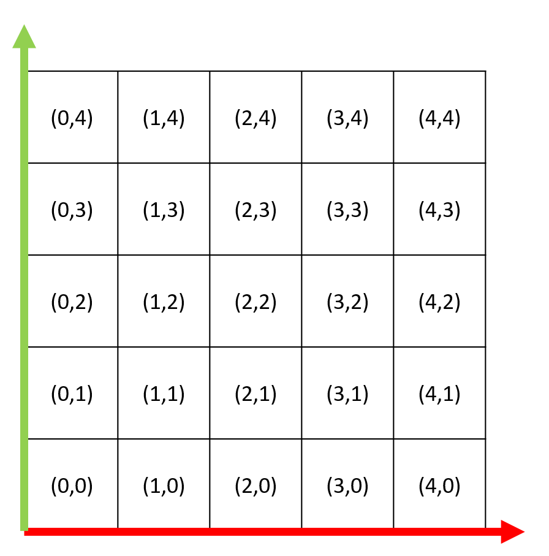
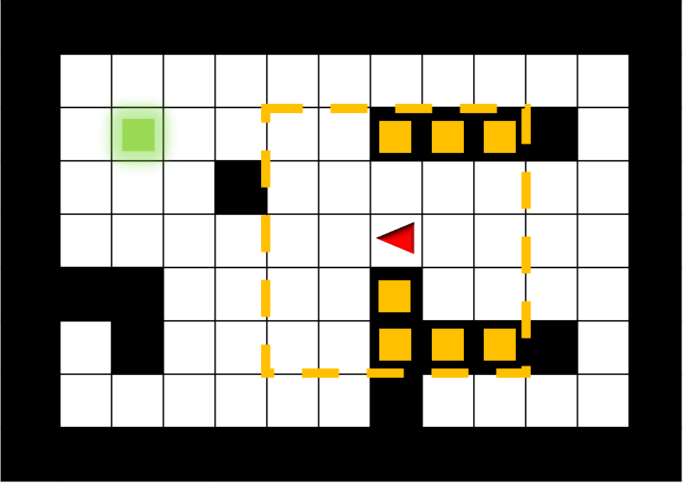

# robot100
Stanford AA228/CS238 Final Project

## Setup
Install needed dependencies:  
`pip3 install PyQt5 pyqtgraph numpy`

## Execution
`python3 main.py`

## Option
To see all available execution options, run `python3 main.py -h`

Some typical parameters:

Size of gridworld: -s (int) (int) (right now, the two dimensions have to be equal)

Percentage of spots are obstacles: -o (float)

Method: -m (0: monte carlo (default), 1: direct, 2: random)

## Problem Variables

  <em>indexing into the grid worlds</em>
 

 

  <em>The robot (red) going towards goal (green). In this example, the robot has a vision depth of 2 and can only see the obstacles within the yellow dashed boundary</em>
 

